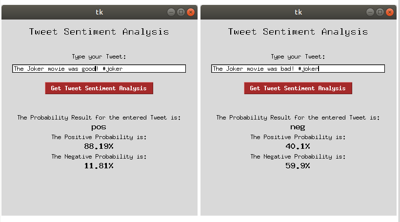

# SentimentAnalysis

To run:

`python display.py` for the desktop app to show probability for custom tweet

`python twitterSentimentAnalysis.py` for the analysis on the NLT corpus twitter data set

Example: 

